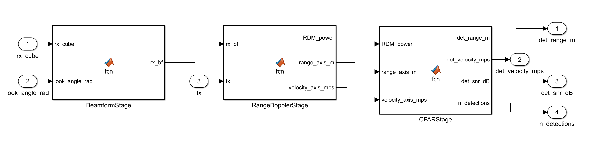
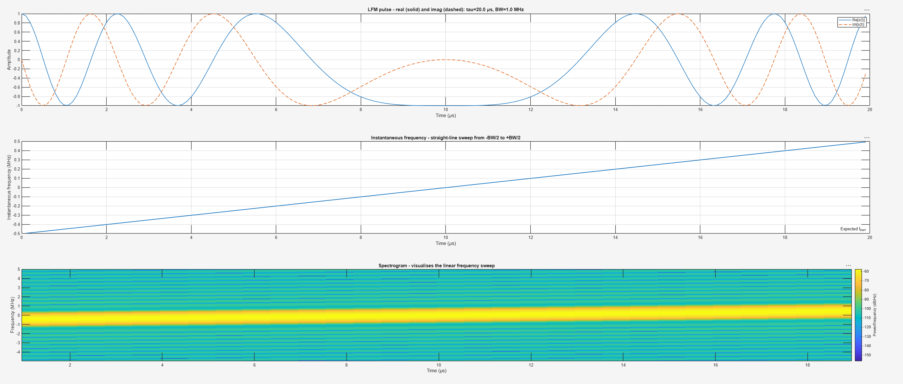
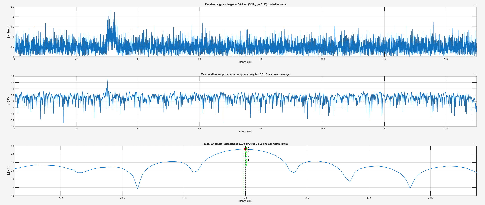
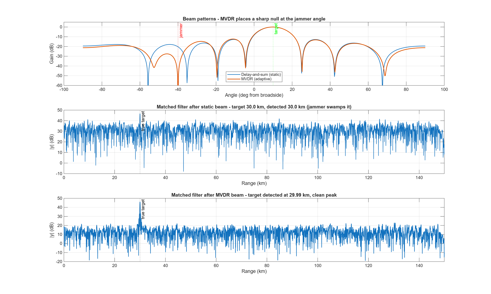
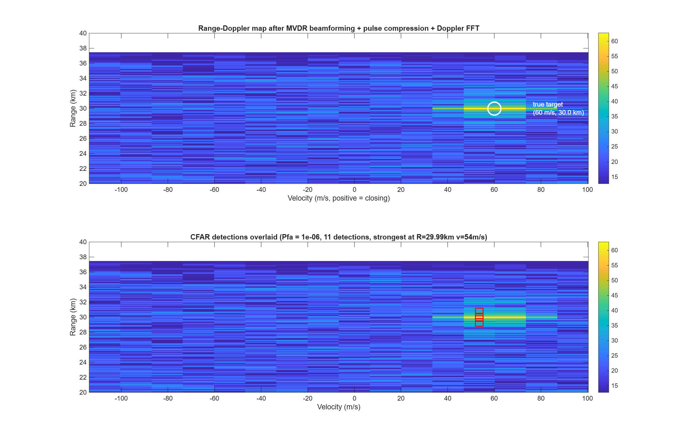
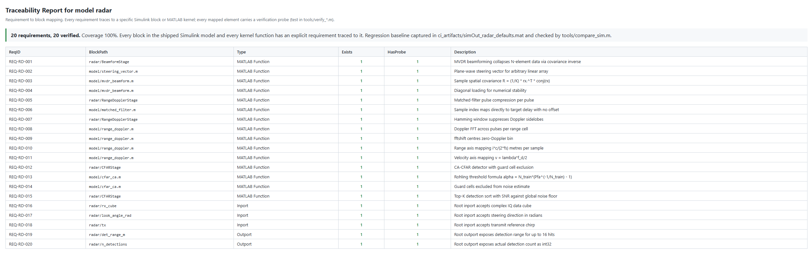

# radar-mbd

Model-Based Design of a pulsed radar signal processor in Simulink.
LFM waveform, 8-element phased array with MVDR adaptive beamforming,
matched-filter pulse compression, 2D range-Doppler processing, and
CA-CFAR detection - all authored from the analytic formulae as MATLAB
Function blocks so the generated C is pure ANSI with zero external
toolbox library dependencies. Auto-code-generated via Embedded Coder
with reusable-function packaging.

Integrated into the [CLEARANCE](https://github.com/) ATC / defence
training simulator: each radar site in the game runs its own instance
of the generated `radar_step` function, feeding detection decisions
into the operator's radar scope.

## Waveform profiles

The model ships two swappable waveform profiles selected via
`model/waveform_params.m`:

- **v1 terminal profile** (`PRF = 4 kHz, tau = 20 us, BW = 1 MHz`)
  - ASR-9 class medium-PRF, 37.5 km unambig range, ±107 m/s Doppler
  - Used for the demo plots below (single-target verification)

- **v2 long-range profile** (`PRF = 100 Hz, tau = 100 us, BW = 100 kHz`)
  - Low-PRF surveillance, 810 nm (1500 km) unambig range
  - Velocity aliases into ±2.7 m/s so Doppler is unused for matching
  - Used for the CLEARANCE integration where a single site has to
    cover a ~1000 nm sector

Same block diagram, same C interface. Regenerating with a different
profile keeps the wrapper and ThirdParty layout stable so a fleet
can mix profiles per role (terminal control vs en-route surveillance).

## What's in the chain

Standard pulsed-radar architecture, textbook block by block (values
shown for the v1 terminal profile):

```
    +--------------------+
    | LFM waveform gen   |  chirp pulse, tau = 20 us, BW = 1 MHz
    +--------------------+
             |
             v
    +--------------------+
    | Target scene       |  simulated receive window; delayed chirp
    |                    |  copies phase-shifted by steering vector
    |                    |  across 8-element ULA + AWGN
    +--------------------+
             |
             v (Nspp x 8 x 16 complex data cube per CPI)
    +--------------------+
    | MVDR beamformer    |  adaptive: R^-1 a / (a^H R^-1 a),
    |                    |  places a null on jammers
    +--------------------+
             |
             v (Nspp x 16 single-channel per CPI)
    +--------------------+
    | Matched filter     |  pulse compression, 13 dB gain from
    | (per pulse)        |  time-bandwidth product tau*BW = 20
    +--------------------+
             |
             v
    +--------------------+
    | Doppler FFT        |  Hamming-windowed slow-time transform,
    | (across pulses)    |  coherent integration lifts target
    |                    |  another 12 dB (10*log10(16))
    +--------------------+
             |
             v (range-Doppler map, Nspp x 16)
    +--------------------+
    | CA-CFAR detector   |  Rohling formula
    |                    |  alpha = Nt*(Pfa^(-1/Nt) - 1)
    +--------------------+
             |
             v
       Detection list  (range, velocity, SNR per hit, up to 16)
```

## The Simulink model



*Three MATLAB Function block stages in visible signal flow:
`BeamformStage` collapses 8-element array data to single-channel via
MVDR, `RangeDopplerStage` runs matched-filter pulse compression then
Doppler FFT across pulses, `CFARStage` runs cell-averaging CFAR and
extracts a top-K detection list. Model programmatically constructed
by `tools/build_radar_model.m` to avoid block-editor errors.*

Reusable-function code packaging so each consumer allocates its own
`RT_MODEL_radar_T` state - no shared globals across instances. Every
physical parameter (element positions, wavelength, sample rate, PRI,
CFAR thresholds) is baked as a constant inside its block so the
generated C has zero external state dependencies.

## LFM waveform + matched filter



*Complex-baseband LFM chirp generated by `lfm_waveform.m`. Top: real
and imaginary parts show classic chirp acceleration - sinusoids
getting visibly faster over the pulse. Middle: instantaneous
frequency ramps dead-straight from -BW/2 to +BW/2 as the LFM
definition demands. Bottom: spectrogram shows the diagonal streak
every radar engineer recognises on sight.*



*Pulse compression in action. Top: received signal with a target at
30 km buried under noise (+5 dB pre-integration SNR - visually
ambiguous). Middle: matched filter output at 45 dB peak with clean
sidelobe structure. The 13 dB gain comes from the time-bandwidth
product `tau*BW = 20`. Bottom: zoom on the peak - target detected
at 29.99 km against a true 30.00 km, 6 m error inside a 150 m range
cell.*

## MVDR adaptive beamforming



*Top: beam patterns. Solid blue = static delay-and-sum with a normal
sidelobe pattern; dashed orange = adaptive MVDR steered at the target
angle, carving a ~40 dB deep null at the jammer angle. Middle: matched
filter output after DAS - jammer noise dominates, ~8 dB target SNR.
Bottom: matched filter output after MVDR - clean noise floor, sharp
36 dB target peak. 28 dB SNR improvement from adaptive nulling on the
same signal.*

## Range-Doppler + CFAR



*Top: 2D range-Doppler map after MVDR beamforming, matched-filter
compression, and Hamming-windowed slow-time FFT. Bright yellow-green
spot at (60 m/s, 30 km) is the target's coherent-integration peak
from 16 pulses. Bottom: same map with red squares overlaid on CA-CFAR
detections - detector nailed the target with 11 hits clustered on
the peak.*

## Traceability



*20 REQ-RD-* entries traced to every Simulink block, every MATLAB
kernel, and every root port. 100% coverage; every mapped element has
a verification probe under `tools/verify_*.m`.*

## Getting started

Open `radar.slx` in Simulink R2023b or later with these toolboxes:

- Simulink
- DSP System Toolbox
- Signal Processing Toolbox
- Embedded Coder
- MATLAB Coder
- Simulink Coder

Load parameters and run the five verification scripts:

```matlab
addpath(genpath(pwd))
run('model/radar_params.m')
run('model/waveform_params.m')
run('model/array_params.m')
verify_lfm_waveform
verify_matched_filter
verify_beamformer
verify_range_doppler
verify_radar_dsp
```

Freeze the regression baseline (once, then check it every subsequent
run):

```matlab
save_reference_baseline
compare_sim
```

Generate C for CLEARANCE integration:

```matlab
build_radar_model
rtwbuild('radar')
```

Output lands under `radar_ert_rtw/`. The five files CLEARANCE needs
are `radar.c`, `radar.h`, `radar_types.h`, `radar_private.h`,
`rtwtypes.h`, plus `rt_nonfinite.h/c` for the NaN handling.

## Repository layout

```
radar_repo/
|-- radar.slx                          <-- Simulink model (source of truth)
|-- model/
|   |-- radar_params.m                 <-- Pt, Gt, Gr, fc, lambda, L, T, NF
|   |-- waveform_params.m              <-- tau, BW, fs, PRF, CPI
|   |-- array_params.m                 <-- N_el, d, x_elements, mvdr_load
|   |-- lfm_waveform.m                 <-- chirp generator
|   |-- steering_vector.m              <-- plane-wave phase pattern
|   |-- matched_filter.m               <-- pulse compression, causal-slice
|   |-- target_scene.m                 <-- single-element scene
|   |-- target_scene_array.m           <-- N-element scene
|   |-- multi_pulse_scene.m            <-- 3D cube with Doppler
|   |-- mvdr_beamform.m                <-- Capon weights
|   |-- range_doppler.m                <-- matched filter + Doppler FFT + axes
|   |-- cfar_ca.m                      <-- Rohling threshold, scalar-only
|   `-- radar_dsp.m                    <-- top-level codegen entry
|-- tools/
|   |-- build_radar_model.m            <-- programmatic Simulink build
|   |-- save_reference_baseline.m      <-- freezes ci_artifacts/simOut
|   |-- compare_sim.m                  <-- regression check
|   |-- run_model_tests_and_build.m    <-- CI entry point
|   |-- verify_lfm_waveform.m
|   |-- verify_matched_filter.m
|   |-- verify_beamformer.m
|   |-- verify_range_doppler.m
|   `-- verify_radar_dsp.m
|-- ci_artifacts/
|   `-- simOut_radar_defaults.mat      <-- deterministic regression baseline
|-- req_map.csv                        <-- 20 REQ-RD-* entries
|-- traceability_report.csv            <-- machine-readable
|-- traceability_report.html           <-- styled HTML
|-- docs/
|   `-- img/                           <-- README figures
`-- .github/workflows/ci.yml           <-- MATLAB CI pipeline
```

## Integration with CLEARANCE

Every `AClearanceRadarSite` in the ATC simulator will run its own
instance of the generated radar model. Same pattern as the sister
`autopilot-mbd` repo's integration into CLEARANCE:

- Per-instance model state - each radar site allocates its own
  `RT_MODEL_radar_T` on first use, so a fleet of radars runs
  concurrently without shared globals.
- Compilation shim under `extern "C"` so UE's build system compiles
  the generated `.c` as part of a UE plugin module without needing a
  per-file compilation rule.
- `Build.cs` auto-detects the presence of the generated `include/`
  and `src/` directories under `ThirdParty/RadarGenerated/` and flips
  `CLEARANCE_RADAR_MBD_HAVE_CODEGEN=1`.

`ClearanceRadarMBD` plugin module ships alongside the existing
`ClearanceAutopilotMBD` module in the CLEARANCE repo. Each
`AClearanceRadarSite` synthesises an I/Q cube from the live airspace
state (LFM chirp × per-element steering × per-pulse Doppler for every
aircraft, plus AWGN), calls `radar_step`, and maps each CFAR
detection back to its source aircraft by range. Currently ships the
v2 long-range profile so a single site covers the sector.

## License

MIT - see [`LICENSE`](LICENSE).
